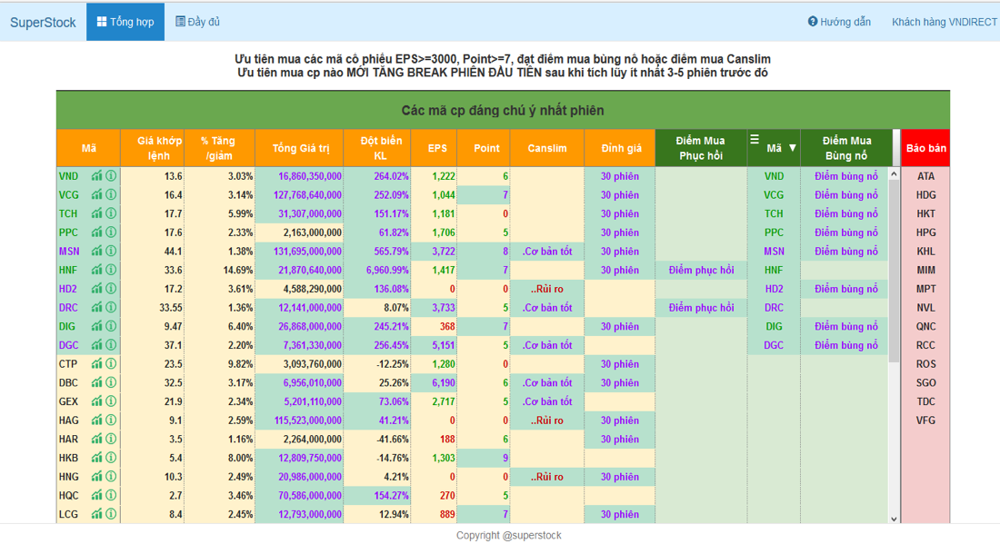

## Hướng dẫn sử dụng bảng tổng hợp canslim.vn


Triết lý đánh chứng của Canslim, là **chỉ quan tâm tới các mã cổ phiếu tốt nhất, mạnh nhất,khỏe nhất**, do vậy trong phiên giao dịch, không quan tâm các mã cổ phiếu giảm giá, chỉ theo dõi các **mã cổ phiếu tăng giá tốt+ thanh khoản tốt+ xu hướng uptrend**

Bảng tổng hợp là lọc ra các mã cp đạt tiêu chí này:
**Tăng giá tốt >=1% + giao dịch >= 2 tỷ+  xu hướng Uptrend**

Từ các mã khỏe này, chúng ta sẽ lọc để tìm ra các cơ hội đầu tư tốt nhất, chúng ta xem mã nào báo: 

   **“ĐIỂM PHỤC HỒI” HOẶC “ĐIỂM BÙNG NỔ”, HOẶC “ĐIỂM MUA CANSLIM”**

Khi thấy bảng báo các điểm mua này, chúng ta ngay lập tức xem đồ thị của cổ phiếu, bằng cách nháy vào biểu tượng đồ thị: 

### Markdown

Markdown is a lightweight and easy-to-use syntax for styling your writing. It includes conventions for

```markdown
Syntax highlighted code block

# Header 1
## Header 2
### Header 3

- Bulleted
- List

1. Numbered
2. List

**Bold** and _Italic_ and `Code` text

[Link](url) and 
```

For more details see [GitHub Flavored Markdown](https://guides.github.com/features/mastering-markdown/).

### Jekyll Themes

Your Pages site will use the layout and styles from the Jekyll theme you have selected in your [repository settings](https://github.com/kidphys/canslimvn_guide/settings). The name of this theme is saved in the Jekyll `_config.yml` configuration file.

### Support or Contact

Having trouble with Pages? Check out our [documentation](https://help.github.com/categories/github-pages-basics/) or [contact support](https://github.com/contact) and we’ll help you sort it out.
