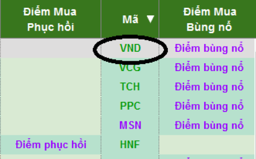
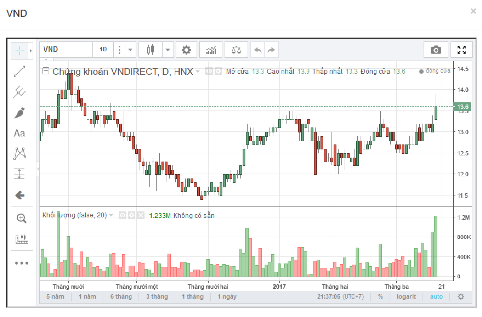

## Hướng dẫn sử dụng bảng tổng hợp canslim.vn

Triết lý đánh chứng của Canslim, là **chỉ quan tâm tới các mã cổ phiếu tốt nhất, mạnh nhất,khỏe nhất**, do vậy trong phiên giao dịch, không quan tâm các mã cổ phiếu giảm giá, chỉ theo dõi các **mã cổ phiếu tăng giá tốt+ thanh khoản tốt+ xu hướng uptrend**

Bảng tổng hợp là lọc ra các mã cp đạt tiêu chí này:
**Tăng giá tốt >=1% + giao dịch >= 2 tỷ+  xu hướng Uptrend**

Từ các mã khỏe này, chúng ta sẽ lọc để tìm ra các cơ hội đầu tư tốt nhất, chúng ta xem mã nào báo: 

   **“ĐIỂM PHỤC HỒI” HOẶC “ĐIỂM BÙNG NỔ”, HOẶC “ĐIỂM MUA CANSLIM”**

Khi thấy bảng báo các điểm mua này, chúng ta ngay lập tức xem đồ thị của cổ phiếu, bằng cách nháy vào biểu tượng đồ thị: 

Hoặc nháy vào ký tự tên mã cổ phiếu nằm ở giữa 2 cột báo mua

Sẽ ra chart như sau:

